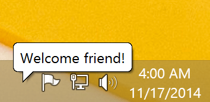

# trayballoon

> Create a trayballoon on Windows



## Install

```
$ npm install trayballoon
```

## Usage

```js
import trayballoon from 'trayballoon';

await trayballoon({
	text: 'Unicorns & rainbows',
	icon: 'ponies.ico',
	timeout: 20000
});

console.log('Trayballoon disappeared');
```

## API

### trayballoon(options)

Return a promise that resolves when the trayballon disappears.

#### options

Type: `object`

##### text

*Required*\
Type: `string`

The body text.

##### title

Type: `string`

The title text.

##### icon

Type: `string`

The path to a `.ico` file or a `.exe`/`.dll` file with icon resource index *(eg: shell32.dll,-154)*.

##### timeout

Type: `number`\
Default: `5000`

The duration to show the balloon in milliseconds.

## CLI

```sh
$ npm install --global trayballoon
```

```
$ trayballoon --help

  Usage
    trayballoon <text>
    echo <text> | trayballoon

  Example
    trayballoon unicorns --title rainbows --icon ponies.ico

  Options
    --title    Title of the balloon
    --icon     Path to a .ico file or .exe/.dll file with icon resource index
    --timeout  Time to show the balloon in milliseconds
    --wait     Wait for the balloon to disappear
```
